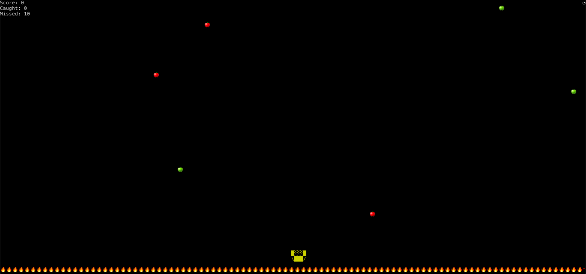

# CatchApple - a cli game where you catch apples!
## Usage
Run `Catch.py` with `python3 Catch.py` (side note: windows not supported)  
### Keyboard controls
- `w`, `a`, `up`, `left`: move left 2 characters
- `s`, `d`, `down`, `right`: move right 2 characters
- `q`: quit
## Setup
Just clone this repo!
## Screenshot
